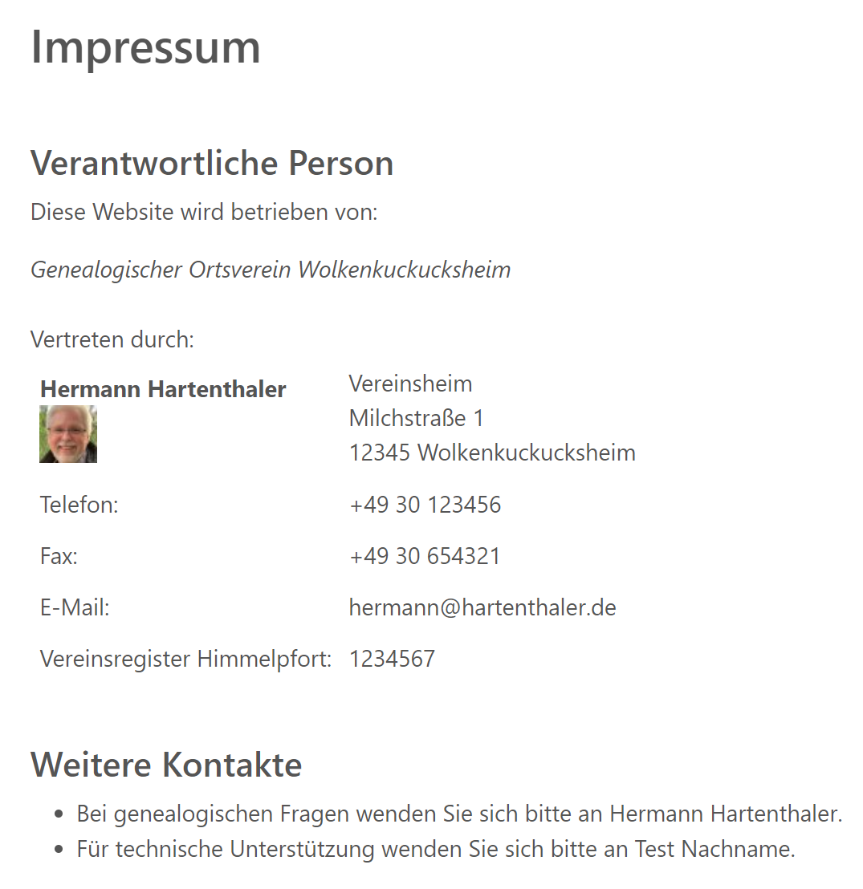
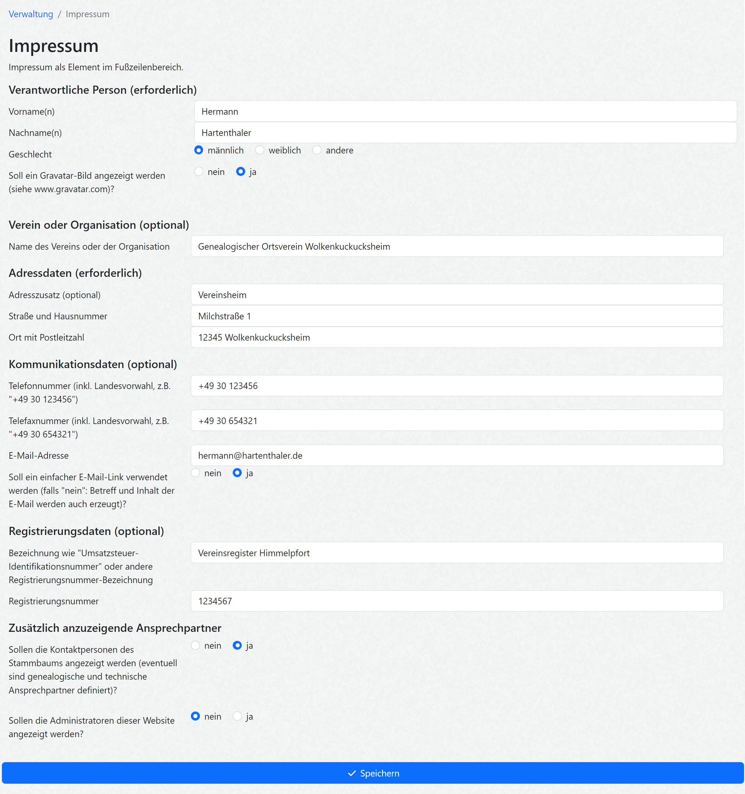

# webtrees module hh_imprint

This [webtrees](https://www.webtrees.net) module creates an imprint/legal notice in the footer of the web page.

There is a German [manual page](https://wiki.genealogy.net/Webtrees_Handbuch/Anleitung_f%C3%BCr_Webmaster/Erweiterungsmodule/Impressum) available, too.

## Contents

This Readme contains the following main sections

* [Description](#description)
* [Screenshots](#screenshots)
* [webtrees](#webtrees)
* [Requirements](#requirements)
* [Installation](#installation)
* [Upgrade](#upgrade)
* [Translation](#translation)
* [Contact Support](#support)
* [Programming and Testing](#programming)
* [License](#license)

## Description

This module adds an imprint notice to all pages of a webtrees site.

There is maybe a need to present on your website an "Imprint"
(depending on your local law and the character of your site)
* Germany: [§5 Telemediengesetz (TMG)](https://lxgesetze.de/tmg/5), 
and [§4 Medienstaatsvertrag (MStV)](https://lxgesetze.de/mstv/4)
* Austria: § 5 Abs. 1 E-Commerce-Gesetz (ECG)
* Switzerland: Art. 3 des Bundesgesetzes gegen den unlauteren Wettbewerb (UWG)

The webtrees admin can define the following data fields in the control panel for the responsible person
* name of genealogical club or organization
* name of responsible person
* address
* phone and fax numbers
* eMail address (with or without subject and body of eMail)
* VAT ID number or other registration number (like a club registration number)

The webtrees admin can choose if the following additional parts should be shown
* image of the responsible person using the [Gravatar](https://gravatar.com/)
* list of contact persons for a tree (genealogical and technical)
* list of administrators of this site with their contact links

## Screenshots

Screenshot of imprint (in German language)

Screenshot of control panel page (in German language)

## webtrees

**[webtrees](https://webtrees.net/)** is an online collaborative genealogy application.
This can be hosted on your own server by following the [Install instructions](https://webtrees.net/install/).
If you are familiar with Docker, you might like to install **webtrees** using [this unofficial docker image](https://hub.docker.com/r/nathanvaughn/webtrees), [or this one](https://github.com/H2CK/webtrees).

## Requirements

This module requires **webtrees** version 2.1 or later.
This module has the same requirements as [webtrees#system-requirements](https://github.com/fisharebest/webtrees#system-requirements).

This module was tested with **webtrees** 2.1.15 version
and all available themes and all other custom modules.

## Installation

This section documents installation instructions for this module.

1. Make a database backup
2. Download the [latest release](https://github.com/hartenthaler/hh_imprint/releases/latest)
3. Unzip the package into your `webtrees/modules_v4` directory of your web server
4. Rename the folder to `hh_imprint`
5. Login to **webtrees** as administrator, go to Control Panel/Modules/Website/Footers, and find the module. It will be called "Imprint". Check if it has a tick for "Enabled".
6. Click at the wrench symbol and add all desired information fields
7. Maybe you like to deactivate the module "contact information" (depending whether you have activated this in the imprint module).
8. Finally, click SAVE, to complete the installation.

## Upgrade

To update simply replace the `hh_imprint` files
with the new ones from the latest release.

## Translation

You can translate into a language you are fluent in by joining the
[PO Editor project](https://poeditor.com/join/project/zscMiujN1m).

But you can also use a local editor,
like Poedit or Notepad++ to make the translations and send them back to me.
You can do this via a pull request (if you know how) or by e-mail.

Discussion on translating can be done by creating an [issue](https://github.com/hartenthaler/hh_imprint/issues).

Updated translations will be included in the next release of this module.

There are now, beside English, Dutch (by TheDutchJewel) and German, no other translations available.

## Support

**Issues**: for any ideas you have, or when finding a bug you can raise an [issue](https://github.com/hartenthaler/hh_imprint/issues).

**Forum**: general webtrees support can be found at the [webtrees forum](http://www.webtrees.net/).

## Programming and Testing

If you'd like to contribute to this module, great! You can contribute by

- Contributing code - check out the issues for things that need attention. If you have changes you want to make not listed in an issue, please create one, then you can link your pull request.
- Testing - it's all manual currently, please [create an issue](https://github.com/hartenthaler/hh_imprint/issues) for any bugs you find.

## License

* Copyright (C) 2023 Hermann Hartenthaler
* Derived from **webtrees** - Copyright 2023 webtrees development team.

This program is free software: you can redistribute it and/or modify
it under the terms of the GNU General Public License as published by
the Free Software Foundation, either version 3 of the License, or
(at your option) any later version.

This program is distributed in the hope that it will be useful,
but WITHOUT ANY WARRANTY; without even the implied warranty of
MERCHANTABILITY or FITNESS FOR A PARTICULAR PURPOSE. See the
GNU General Public License for more details.

You should have received a copy of the GNU General Public License
along with this program. If not, see <http://www.gnu.org/licenses/>.

* * *